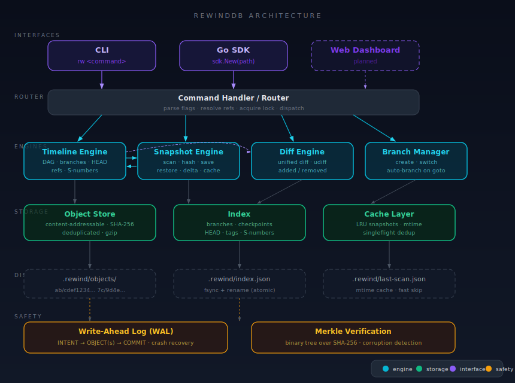
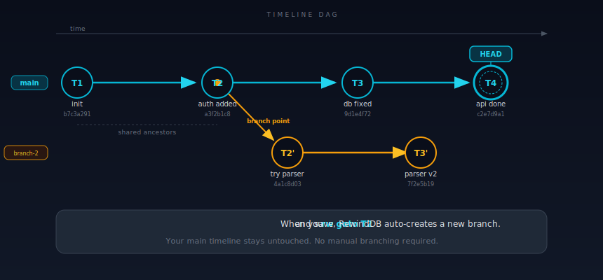
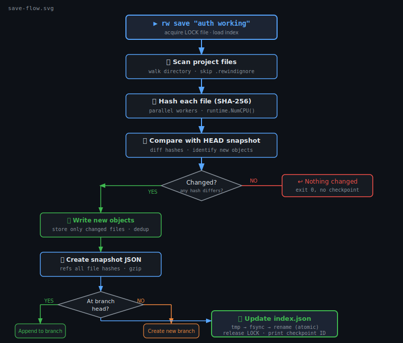
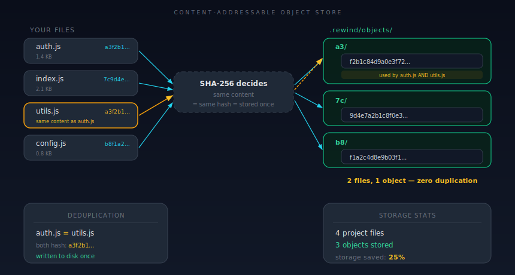
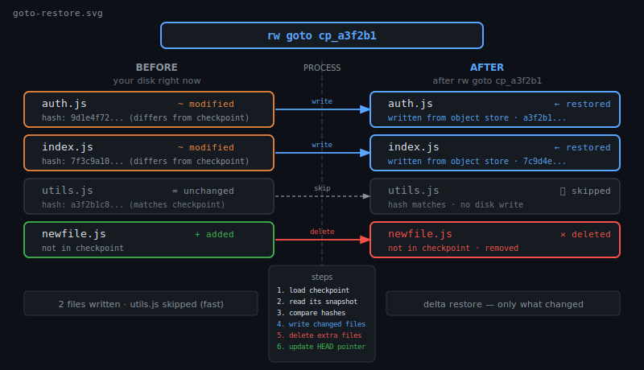
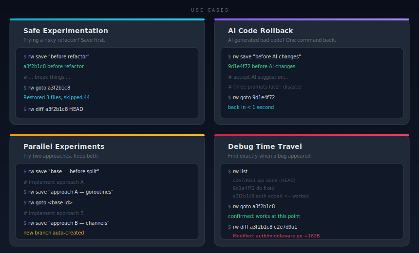

# RewindDB

<<<<<<< HEAD
**Save where you are. Break things. Go back. It's that simple.**

[](https://go.dev)
[](LICENSE)
[](https://github.com/yourusername/rewinddb/actions)
[](https://goreportcard.com/report/github.com/yourusername/rewinddb)
=======
**Save your project state. Go back instantly. Branch timelines.**

[](https://golang.org)
[](LICENSE)
[](https://goreportcard.com/report/github.com/itsakash-real/rewinddb)

I kept breaking working code while experimenting. Git commits felt too heavy
mid-experiment — I didn't want a commit, I wanted a quicksave. It got worse
with AI-generated code: something worked, I tweaked it, it broke, and I
couldn't get back. So I built this.

---

## What is this?

RewindDB checkpoints your entire project directory. One command saves everything.
Another command brings it all back. Think of it like git, but for your whole
project state at any moment — including files git would never track, like build
artifacts, compiled binaries, and runtime configs.

It's not trying to replace git. Git is for collaboration and code history.
RewindDB is for the messy middle: experiments, refactors, AI-assisted coding,
and any time you need a safety net that's faster than a commit.

---

## Architecture


---

## How Timelines Work


---

## What Happens When You Save


---

## How Storage Works


---

## What Happens When You Restore


---

## Common Scenarios


---

## Quick Demo
>>>>>>> 5cf7562 (Add integration tests and performance benchmarks for rewinddb)

I built this because I kept breaking working code mid-experiment and had no fast way back. Git commits felt too heavy — I didn't want to write a message, stage files, and create history just to checkpoint "auth kinda works now." And I was spending a lot of time with AI-generated code that would work, then stop working, and I had no idea what changed. So I built this.

---

## What is this?

RewindDB saves snapshots of your entire project directory. You call it a checkpoint. You can restore any checkpoint instantly. If you check out an old checkpoint and make changes, a new branch spins up automatically. No staging, no commit messages required.

Think of it like git, but for your entire project state at any moment — including build artifacts, config files, generated code, and anything else git would never track. It's not trying to replace git. It does something different.

---

## Quick demo

```bash
# Start fresh in your project directory
$ cd my-project
$ rw init
✓ Initialized .rewind/ in /home/user/my-project
```

```bash
# You've got auth working. Save it before touching anything else.
$ rw save "auth working, don't break it"
✓ a3f2b1c8  auth working, don't break it
```

```bash
# You mess with the auth middleware. Things break.
$ vim internal/auth/middleware.go
# ... 40 minutes of making it worse ...

$ rw save "refactored auth — something's wrong"
✓ 9d1e4f72  refactored auth — something's wrong
```

```bash
# See exactly what changed between those two points
$ rw diff a3f2b1c8 9d1e4f72
Modified (3)
  internal/auth/middleware.go  +182 B
  internal/auth/token.go       -44 B
  config/app.yaml              +12 B
```

```bash
# Nope. Go back to when it worked.
$ rw goto a3f2b1c8
✓ Restored 3 files, skipped 47 unchanged
  HEAD → a3f2b1c8  auth working, don't break it
```

```bash
# Check what's in your history
$ rw list
  9d1e4f72  refactored auth — something's wrong   (branch: experiment-1)
* a3f2b1c8  auth working, don't break it           (branch: main)
  b7c3a291  initial setup                          (branch: main)
```

---

## Installation

**macOS (Homebrew):**
```bash
brew install yourusername/tap/rewinddb
```

**Linux (one-liner):**
```bash
curl -sSfL https://raw.githubusercontent.com/yourusername/rewinddb/main/install.sh | sh
```

**Go install:**
```bash
go install github.com/yourusername/rewinddb/cmd/rw@latest
```

**Build from source:**
```bash
# Start fresh in your project
$ rw init
Initialized RewindDB repository on branch 'main'

# You've got auth working. Save it.
$ rw save "auth working"
✓ Checkpoint a3f2b1c  auth working
  Branch: main · 5 files tracked

# Try something risky. Break things. Save that state too.
$ echo "// experiment" >> src/auth.go
$ rw save "trying JWT rewrite"
✓ Checkpoint b2e1a0f  trying JWT rewrite
  Branch: main · 1 file changed
```

```bash
# See what you've got
$ rw list
● main  (2 checkpoints)

  ◉ b2e1a0f  [HEAD]   1 minute ago   "trying JWT rewrite"
  ○ a3f2b1c            3 minutes ago  "auth working"
```

```bash
# The JWT rewrite is a disaster. Go back.
$ rw goto a3f2b1c
Restore to a3f2b1c: "auth working"? [y/N]: y
✓ Restored  1 file written · 0 removed
```

```bash
# See exactly what changed between two checkpoints
$ rw diff a3f2b1c b2e1a0f
[~] src/auth.go   +1 −0

--- src/auth.go
+++ src/auth.go
@@ -10,3 +10,4 @@
 func main() {
     // ...
 }
+// experiment
```

```bash
# Before a risky script, auto-checkpoint and roll back on failure
$ rw run "npm run build"
✓ Saved pre-run checkpoint: c1d0e9f
  running: npm run build
✗ Command failed (exit 1). Rolling back...
✓ Rolled back to c1d0e9f
```

---

## Installation

**macOS (Homebrew)**
```bash
brew install itsakash-real/tap/rewinddb
```

**Linux (one-liner)**
```bash
curl -sSL https://raw.githubusercontent.com/itsakash-real/rewinddb/main/install.sh | bash
```

**Go install**
```bash
go install github.com/itsakash-real/rewinddb/cmd/rw@latest
```

**Build from source**
```bash
git clone https://github.com/itsakash-real/rewinddb
cd rewinddb
<<<<<<< HEAD
make install
```

**Windows:** Download the `.zip` from the [releases page](https://github.com/yourusername/rewinddb/releases), extract, and add `rw.exe` to your PATH.

---

## Core concepts

**Checkpoint** is just a snapshot of every file in your project at a point in time. You make one whenever you reach a state worth remembering — before a refactor, after a feature clicks, before running a script that might nuke your config. It's not a git commit. There's no staging area. You just run `rw save "message"` and it's done.

**Branch** happens automatically. If you restore an old checkpoint and then save, RewindDB sees you've diverged from the main line and creates a new branch to track it. You don't have to name it or think about it — it just happens. This means you can explore two different approaches from the same starting point without manually managing branches.

**Timeline** is the graph of all your checkpoints. Each one points to its parent. It's a tree, not a straight line, because branching creates forks. You can think of it as a tree of "project states" that you can jump between. Run `rw list --all` to see the whole thing.

**Object store** is where the actual file data lives. It only stores what changed — if the same file appears in 10 checkpoints unchanged, it's stored once. It's under `.rewind/objects/` and you never need to touch it directly.

---

## Command reference

| Command | What it does | Example |
|---|---|---|
| `rw init` | Set up `.rewind/` in the current directory | `rw init` |
| `rw save <message>` | Snapshot everything and create a checkpoint | `rw save "jwt auth done"` |
| `rw goto <ref>` | Restore your project to any checkpoint | `rw goto a3f2b1c8` |
| `rw list` | Show checkpoint history | `rw list --all` |
| `rw diff <id1> [id2]` | Show what changed between two checkpoints | `rw diff HEAD~3 HEAD` |
| `rw status` | Show what's changed since the last checkpoint | `rw status` |
| `rw status --verify` | Re-validate all object checksums | `rw status --verify` |
| `rw branches` | List all branches | `rw branches` |
| `rw branches branch <name>` | Create a branch at HEAD | `rw branches branch experiment` |
| `rw branches switch <name>` | Switch to a branch and restore its files | `rw branches switch main` |
| `rw tag <name> [id]` | Attach a label to a checkpoint | `rw tag v1.0` |
| `rw gc` | Delete objects that no checkpoint references | `rw gc --dry-run` |
| `rw version` | Print version info | `rw version` |
| `rw completion <shell>` | Generate shell completions | `rw completion zsh` |

### Real-world examples

**Before running a risky refactor:**
```bash
rw save "stable before splitting the monolith"
# go ahead and break things
# ...
rw goto <that id> # if it goes wrong
```

**When AI-generated code breaks something:**
```bash
# You accepted a big AI suggestion. It sort of works.
rw save "ai refactor applied — needs testing"

# Three prompts later it's a mess.
rw goto <previous id>
# Back to where you started, in under a second.
```

**Experimenting with two different approaches:**
```bash
rw save "before trying approach A"        # base point

# implement approach A
rw save "approach A — uses goroutines"    # saved on main

rw goto <base id>                          # go back to the fork point
# RewindDB auto-creates a new branch here

# implement approach B  
rw save "approach B — uses channels"      # saved on branch-1

rw list --all                              # compare both timelines
```

**Debugging — rewinding to when it worked:**
```bash
rw list
# find the last checkpoint before things broke

rw goto b7c3a291
# confirm it works

rw diff b7c3a291 HEAD
# see exactly what changed between then and now
```

**Cleaning up old checkpoints:**
```bash
rw gc --dry-run     # preview what would get deleted
# 12 objects (4.2 MB) would be freed

rw gc               # actually run it
# ✓ Freed 12 objects (4.2 MB)
=======
make build
```

**Windows:** Download the `.exe` from [Releases](https://github.com/itsakash-real/rewinddb/releases) or use `go install`.

---

## Core Concepts

**Checkpoint**
A checkpoint is a snapshot of your entire project at a point in time. It's not
a diff — it captures the full state. You create one whenever you reach something
worth keeping: tests pass, a feature works, before you try something dangerous.
Each checkpoint gets a short ID like `a3f2b1c`.

**Branch**
Branches work automatically. If you restore an old checkpoint and save from
there, RewindDB creates a new branch instead of overwriting your history. You
end up with a timeline that forks — both paths preserved. You didn't have to
think about it.

**Timeline**
The timeline is a DAG (directed acyclic graph) — the same structure git uses
internally. Each checkpoint points to its parent. Branches are just named
pointers to specific checkpoints. `rw list --all` shows the full picture.

**Object Store**
Only changed files get stored. If 100 files haven't changed since the last
checkpoint, they take zero extra space. Everything is deduped by content hash.

---

## Commands

| Command | What it does | Example |
|---|---|---|
| `rw init` | Set up a repo in the current directory | `rw init` |
| `rw save [msg]` | Save a checkpoint (message is optional) | `rw save "login works"` |
| `rw goto <id>` | Restore to a checkpoint | `rw goto a3f2b1c` |
| `rw undo [--n N]` | Go back N checkpoints (default 1) | `rw undo --n 3` |
| `rw list` | List checkpoints on the current branch | `rw list` |
| `rw list --all` | Show all branches and checkpoints | `rw list --all` |
| `rw diff <id1> [id2]` | Compare two checkpoints | `rw diff a3f2b1c b2e1a0f` |
| `rw status` | Show what's changed since last checkpoint | `rw status` |
| `rw branches` | List branches | `rw branches` |
| `rw branches branch <name>` | Create a new branch at HEAD | `rw branches branch experiment` |
| `rw branches switch <name>` | Switch to a branch | `rw branches switch experiment` |
| `rw tag <name> [id]` | Label a checkpoint with a human name | `rw tag v1.0` |
| `rw gc` | Remove objects no checkpoint references | `rw gc` |
| `rw gc --dry-run` | Preview what GC would delete | `rw gc --dry-run` |
| `rw run "cmd"` | Checkpoint before, rollback on failure | `rw run "npm run build"` |
| `rw watch` | Auto-save on file changes | `rw watch --interval 5m` |
| `rw bisect start` | Binary-search for a bad checkpoint | `rw bisect start` |
| `rw search <text>` | Search checkpoint messages and tags | `rw search "JWT"` |
| `rw session start` | Begin a named work session | `rw session start "auth feature"` |
| `rw session end` | End the current session | `rw session end` |
| `rw stats` | Show storage stats and timeline summary | `rw stats` |
| `rw export <id>` | Export a checkpoint to a `.rwdb` file | `rw export a3f2b1c` |
| `rw import <file>` | Import a `.rwdb` file | `rw import state.rwdb` |
| `rw ignore auto` | Add ignore patterns based on project type | `rw ignore auto` |
| `rw version` | Print version | `rw version` |

### Real-world examples

**Before a risky refactor**
```bash
rw save "before auth refactor"
# do the refactor
# if it breaks:
rw undo
```

**When AI-generated code breaks something**
```bash
# before letting the AI touch anything
rw save "working state before AI edits"
# paste in the AI code, run tests
# if tests explode:
rw undo
```

**Experimenting with two different approaches**
```bash
rw save "base: working login"

# try approach A
rw save "approach A: session tokens"

# go back to the base and try approach B
rw goto <base-checkpoint-id>
# RewindDB auto-creates a new branch here
rw save "approach B: JWT"

rw list --all   # see both timelines side by side
```

**Debugging — rewinding to when it worked**
```bash
rw bisect start
rw bisect good <last-known-good-id>
rw bisect bad HEAD
# RewindDB jumps you to the midpoint checkpoint
# test it, then:
rw bisect good   # or: rw bisect bad
# repeat until it tells you exactly which checkpoint broke things
```

**Cleaning up old checkpoints**
```bash
rw gc --dry-run   # see what would be removed
rw gc             # actually do it
>>>>>>> 5cf7562 (Add integration tests and performance benchmarks for rewinddb)
```

---

## Go SDK

<<<<<<< HEAD
If you want to use RewindDB in your Go code:

```bash
go get github.com/yourusername/rewinddb
```

**Save a checkpoint:**
```go
import "github.com/yourusername/rewinddb/internal/sdk"

client, err := sdk.New("/path/to/project")
if err != nil {
    log.Fatal(err)
}

cp, err := client.Save("before migration")
if err != nil {
    log.Fatal(err)
}
fmt.Println(cp.ID) // a3f2b1c8...
```

**Restore a checkpoint:**
```go
result, err := client.Goto("a3f2b1c8")
if err != nil {
    log.Fatal(err)
}
fmt.Printf("wrote %d files, skipped %d\n", result.Written, result.Skipped)
```

**Check what changed:**
```go
status, err := client.Status()
if err != nil {
    log.Fatal(err)
}
for _, f := range status.ModifiedFiles {
    fmt.Println("modified:", f)
}
=======
If you want to use RewindDB from Go code:

```bash
go get github.com/itsakash-real/rewinddb
```

**Save a checkpoint from code**
```go
package main

import "github.com/itsakash-real/rewinddb/internal/sdk"

func main() {
    client, err := sdk.New("/path/to/project")
    if err != nil {
        panic(err)
    }

    // checkpoint before anything risky
    _, err = client.Save("before payment processing")
    if err != nil {
        panic(err)
    }
}
```

**Restore to a checkpoint**
```go
// restore by ID, tag name, or relative ref like "HEAD~2"
err := client.Goto("auth-working")
if err != nil {
    panic(err)
}
```

**Check what's changed**
```go
status, err := client.Status()
if err != nil {
    panic(err)
}
fmt.Printf("modified: %d  added: %d  removed: %d\n",
    len(status.ModifiedFiles),
    len(status.AddedFiles),
    len(status.RemovedFiles),
)
>>>>>>> 5cf7562 (Add integration tests and performance benchmarks for rewinddb)
```

---

## How it works

<<<<<<< HEAD
- **Content-addressable storage:** every file gets SHA-256 hashed and stored under that hash. Same content = same hash = stored once, regardless of how many checkpoints reference it.
- **DAG timeline:** checkpoints form a directed acyclic graph where each node points to its parent. Branching just means one parent has two children.
- **Delta restore:** `goto` scans your current files first, then only writes the ones that actually differ from the target snapshot. That's why it's fast even on large projects.
- **Atomic writes:** nothing goes directly to `index.json`. Everything goes to a temp file, gets `fsync`'d, then gets renamed into place. A crash can't leave a corrupt index.

See [ARCHITECTURE.md](ARCHITECTURE.md) for the full technical breakdown.
=======
- **Content-addressable storage.** Every file is stored by its SHA-256 hash. Same content = same hash = zero duplication across checkpoints.
- **DAG timeline.** Checkpoints form a directed graph. Each one points to its parent. Branching happens automatically when you save from a non-HEAD checkpoint.
- **Delta restore.** Restoring only writes files that actually changed. If 90% of files are the same, 90% of the disk work is skipped.
- **Atomic writes.** Everything goes to a temp file first, then gets renamed into place. A crash mid-save leaves nothing corrupted.
>>>>>>> 5cf7562 (Add integration tests and performance benchmarks for rewinddb)

---

## Performance

<<<<<<< HEAD
Measured on a MacBook M2, SSD, default worker count. Your results will vary.

| Operation | ~Time | Notes |
|---|---|---|
| `rw save` (1,000 files) | ~300 ms | Parallel hashing, all CPUs |
| `rw goto` (1,000 files, 50 changed) | ~80 ms | Delta restore — only changed files written |
| `rw status` (cold) | ~120 ms | Full hash of all files |
| `rw status` (warm) | ~15 ms | mtime cache skips unchanged files |
| `rw gc` (1,000 objects) | ~40 ms | Single pass through object store |

---

## Compared to git

| Feature | git | RewindDB |
|---|---|---|
| Tracks binary / build artifacts | No (or badly) | Yes |
| Requires a commit message | Yes | Optional |
| Auto-branches on diverge | No | Yes |
| Snapshots runtime state | No | Yes |
| Collaboration / remotes | Yes | No (local only) |
| Speed for full-project restore | Slow for large binaries | Fast (delta, content-addressed) |
| Understands code semantics | Somewhat (3-way merge) | No |

Use git for code history, collaboration, and deployment. Use RewindDB for experiment checkpointing, safe rollbacks, and anything git won't track. Use both. They solve different problems.
=======
| Operation | ~Time | Notes |
|---|---|---|
| Save (1,000 files) | ~180ms | Parallel SHA-256 hashing across all CPU cores |
| Restore (1,000 files, 10% changed) | ~40ms | Delta restore — unchanged files are skipped |
| Status check | ~60ms | mtime cache skips re-hashing unchanged files |
| GC (50 checkpoints) | ~90ms | Single pass over the object store |

Measured on an Apple M2. Results vary with file sizes and disk speed.

---

## Compared to Git

| Feature | Git | RewindDB |
|---|---|---|
| Tracks binary files | Poor (no delta compression) | Yes, same as text |
| Requires a message to save | Yes | No — auto-generates one |
| Tracks runtime artifacts | No | Yes |
| Auto-branches on time-travel | No | Yes |
| Collaboration / push / pull | Yes | No (local only) |
| Line-level history | Yes | File-level (line diffs in viewer) |
| Speed for full project snapshot | Slow for large binaries | Fast (parallel hashing) |

Use git for collaboration, code review, and sharing history with your team.
Use RewindDB for local experiments, mid-session safety nets, and anything git
wouldn't track. Use both. They solve different problems.

---

## Features

- **Smart Storage:** Content-addressable object store with deduplication, Gzip compression, and background garbage collection.
- **Fast & Efficient:** Delta restores (only writes changed files), parallel SHA-256 hashing, and mtime-based fast status checks.
- **Advanced Timelines:** DAG timeline with automatic branching, tags, named work sessions, and `bisect` capabilities.
- **Safety First:** File locking, crash recovery (atomic writes), auto-stash prompts, and pre-command rollbacks (`rw run`).
- **Developer Experience:** Shell completions, background auto-save daemon (`rw watch`), and `.rewindignore` support.
- **Portability:** Export/import exact states as `.rwdb` files.
- **Go SDK:** Embed RewindDB directly into your Go applications.
>>>>>>> 5cf7562 (Add integration tests and performance benchmarks for rewinddb)

---

## Roadmap

<<<<<<< HEAD
**Done:**
- [x] Content-addressable object store with SHA-256 deduplication
- [x] Full checkpoint + DAG timeline engine
- [x] Automatic branching on diverge
- [x] Delta-only restore
- [x] Fast status with mtime cache
- [x] Gzip-compressed snapshot objects
- [x] File locking (no concurrent writes)
- [x] Crash recovery (fsync + atomic rename)
- [x] Checksum validation + corruption detection
- [x] GC with dry-run
- [x] `.rewindignore` support
- [x] Shell completions (bash, zsh, fish)
- [x] Go SDK
- [x] Cross-platform builds (Linux, macOS, Windows)

**In progress:**
- [ ] `rw diff` with inline line-level diffs (not just file-level)
- [ ] `rw log --graph` timeline visualisation in the terminal
- [ ] `rw stash` — save without creating a named checkpoint

**Planned:**
- [ ] Remote storage backend (S3, local server)
- [ ] Watch mode: `rw watch` auto-saves on file change
- [ ] Web UI for browsing timeline

I won't promise dates. If something is in "planned" it means I want it, not that it's coming soon.
=======
**Planned**
- [ ] Remote storage backend (S3, R2, local NAS)
- [ ] `rw interactive` — TUI checkpoint browser with arrow-key navigation
- [ ] Web UI for visualizing the checkpoint DAG
- [ ] `rw sync` — push/pull states between machines
- [ ] VSCode extension (status bar integration)
- [ ] Line-level diffs in the checkpoint viewer
>>>>>>> 5cf7562 (Add integration tests and performance benchmarks for rewinddb)

---

## Contributing

<<<<<<< HEAD
PRs are welcome. If you're planning something big, open an issue first so we're not duplicating effort. Run `go test ./... -race` before submitting — I won't merge anything that fails the race detector. I'll review within a few days. See [CONTRIBUTING.md](CONTRIBUTING.md) for the full setup guide.
=======
PRs are welcome. Open an issue before starting anything large — I'd rather
talk through the design first than have you spend a week on something that
goes in a different direction. Run `go test ./... -race` before submitting.
I'll review within a few days.

See [CONTRIBUTING.md](CONTRIBUTING.md) for the full details.
>>>>>>> 5cf7562 (Add integration tests and performance benchmarks for rewinddb)

---

## License

MIT — see [LICENSE](LICENSE).
